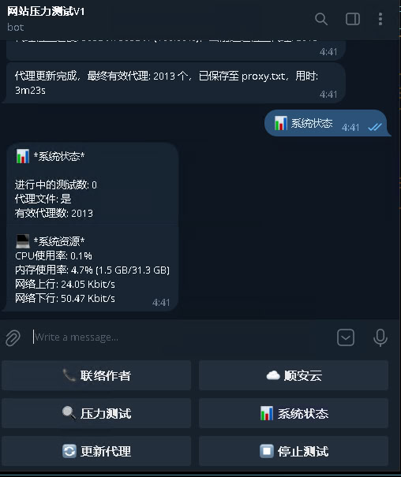

# ED 网站压力测试系统 v1.0 / ED Stress test for Web site (cc)



## 简介

ED 网站压力测试系统 (stresscc) 是一款专为测试网站抗压能力而设计的工具，可帮助发现安全漏洞并优化网站性能。本程序专为 Ubuntu 22 和 Ubuntu 24 系统优化，能够充分利用系统资源进行高效的并发压力测试。

> ⚠️ **免责声明**: 本工具仅应用于测试自有网站的抗压能力。严禁将本工具用于任何非法用途。

## 系统要求

- Ubuntu 22 或 Ubuntu 24
- 最低配置：8核CPU、8GB内存、50M带宽
- 推荐使用空闲主机运行，避免影响其他服务
- 如未有主机，推荐在[顺安云](https://www.say.cc)租用,香港老牌云主机供应商 

## 安装与使用

### 1. 系统准备

在运行压力测试前，请先增强系统连接数限制,：

```bash
ulimit -n 1024000
```

### 2. 下载程序

```bash
curl -o stresscc https://raw.githubusercontent.com/saycc1982/stresscc/refs/heads/main/stresscc && chmod 755 stresscc
```

### 3. 基本使用方法

#### 命令行模式

```bash
# 基础压力测试（1000线程，持续300秒）
./stresscc -url 'https://example.com' -t 1000 -ttl 300

# 使用本地代理文件进行压力测试
./stresscc -url 'https://www.example.com' -t 500 -ttl 60 -file ./my_proxies.txt

# 强制更新代理列表
./stresscc -update
```

#### Telegram远程控制模式

```bash
# 启动Telegram远程控制模式
./stresscc -telegram-config ./telegram.conf
```

Telegram配置文件格式（telegram.conf）：
```
YOUR_BOT_TOKEN
YOUR_USER_ID
```

### 4. 主要参数说明

#### 必选参数
- `-url string`: 目标网站URL（如 'https://example.com'）
- `-telegram-config string`: Telegram配置文件路径（远程控制模式）

#### 代理相关参数
- `-update`: 强制更新代理列表
- `-file string`: 本地代理文件路径
- `-f int`: 代理格式类型
- `-type string`: 代理类型（http, https, socks4, socks5）
- `-batch int`: 代理检查批处理大小（默认10000）
- `-sem int`: 代理检查并发数（默认5000）

#### 测试配置参数
- `-t int`: 并发线程数（默认3000）
- `-ttl int`: 测试持续时间（单位秒，默认60）
- `-w int`: 代理请求间隔（单位秒，默认0）
- `-wt int`: 工作线程超时时间（单位秒，默认30）
- `-force-ttl bool`: 强制按TTL时间执行（默认true）

#### 请求配置参数
- `-m string`: 请求方法（get/post，默认get）
- `-data string`: POST数据文件路径
- `-cookie string`: 自定义Cookie
- `-random int`: 是否添加随机参数（默认1）
- `-rname string`: 随机参数名称（默认'id'）
- `-refererpath string`: Referer文件路径

### 5. 使用示例

#### 命令行模式示例

```bash
# 基础压力测试
./stresscc -url 'https://example.com' -t 1000 -ttl 300

# 使用POST方法的压力测试
./stresscc -url 'https://example.com/api' -m post -data ./post_data.json -t 500 -ttl 60

# 带Cookie和自定义参数的压力测试
./stresscc -url 'https://example.com' -cookie 'sessionid=abc123' -random 1 -t 2000 -ttl 120
```

#### Telegram远程控制模式示例

创建Telegram配置文件：
```bash
echo "123456:ABC-DEF1234ghIkl-zyx57W2v1u123ew11" > telegram.conf
echo "987654321" >> telegram.conf
```

启动Telegram远程控制：
```bash
./stresscc -telegram-config ./telegram.conf
```
如要长驻运行，防止因登出ssh 后断开telegram bot,请用命令（必需先执行命令ulimit -n 1024000 及确保bot id及user id 正确) 
```bash
nohup ./stresscc -telegram-config ./telegram.conf > /dev/null 2>&1 &
```
如要取消背景长驻运行，可以先打命令 ps -aux | grep stresscc 找出程序的id，如id 为1234，再打命令 kill -n 9 1234 就可停止运行。

在Telegram中可以使用以下命令：
- `/start` - 启动机器人
- `🔍 压力测试` - 开始压力测试
- `📊 系统状态` - 查看系统状态
- `🔄 更新代理` - 更新代理列表
- `⏹️ 停止测试` - 停止当前测试
- `📞 联络作者` - 联系开发者
- `☁️ 顺安云` - 云服务信息

[获取Telegram BOT ID 及用户ID 教学](howto_telegram_bot.md)

## 可能遇到的问题及解决方法

### 1. 系统资源限制问题

**问题现象**：
- 程序提示 "ulimit值低于要求的1024000"
- 测试过程中出现大量连接失败

**解决方法**：

### 执行以下命令增强系统连接数限制
```bash
ulimit -n 1024000
```
### 如果需要永久生效，可以执行以下程序来更改系统ulimit 数，完成后要重新登入SSH才会永久生效
```bash
curl -o ulimit.sh https://raw.githubusercontent.com/saycc1982/stresscc/refs/heads/main/ulimit.sh && bash ulimit.sh
```

### 2. 代理相关问题

**问题现象**：
- "未找到有效代理"
- 测试请求成功率低

**解决方法**：
```bash
# 更新代理列表
./stresscc -update

# 检查特定代理文件的有效性
./stresscc -check -file ./my_proxies.txt

# 使用高质量的付费代理服务
# 使用香港的服务器确保可以正常下载免费代理源及成功发出网页请求到代理IP
```

### 3. Telegram模式问题

**问题现象**：
- Telegram机器人无响应
- 无法接收命令
- 执行太多测试数按什么键都没反应

**解决方法**：
1. 确认配置文件格式正确，第一行为Bot Token，第二行为User ID
2. 确认网络可以访问Telegram服务器
3. 检查防火墙设置是否阻止了出站连接
4. 确保服务器身处的国家是允许连接Telegram, 建议使用香港服务器
5. 由于太多测试数会令低配置的服务器吃不消，如太久没回应可以先停止程序再执行，并减少同时测试数量
6. 定时按"系统状态来观察服务器的CPU 内存 带宽等用量是不是过高以减少测试量"
7. 建议先同时测试10个url 为起点，如没有卡住再试20个，直到反应慢或没回应便是你服务器的同时测试上限了

### 4. 测试结果异常

**问题现象**：
- 成功率极低或为0
- 响应时间异常长

**解决方法**：
1. 检查目标网站是否正常运行
2. 尝试使用更少的并发线程数
3. 检查代理质量，使用高质量代理
4. 确认目标网站没有针对压力测试的防护机制

### 5. 内存或CPU使用过高

**问题现象**：
- 系统负载过高
- 程序运行缓慢或崩溃

**解决方法**：
```bash
# 降低并发线程数
./stresscc -url 'https://example.com' -t 500 -ttl 300

# 在性能较低的系统上运行时，使用更少的线程数
```

## 注意事项

1. 执行本程序前请先执行命令增强系统连接数 `ulimit -n 1024000`，需要root权限以获得最佳效果
2. 按 Ctrl+C 可提前终止测试，程序会自动清理资源并输出统计信息
3. 免费代理有效率较低，建议使用 `-update` 获取后复用 proxy.txt，或提供高质量付费代理文件
4. Telegram模式下，仅授权User ID可发送指令，避免未授权访问

## 输出信息

程序运行时会显示以下信息：
- 代理连接状态
- 请求统计（成功/失败次数）
- 响应时间统计
- 带宽使用情况
- 错误统计

测试结束后会输出详细的测试报告，包括：
- 总请求数
- 成功/失败请求数
- 平均响应时间
- 请求速率

## 技术支持

如有建议或BUG反馈，请联系作者：
- Telegram: [@hongkongisp](https://t.me/hongkongisp)

云服务推荐：
- [顺安云](https://www.say.cc) - 香港老牌云主机供应商

## 许可证

本项目仅供合法的性能测试使用，使用者需自行承担相关法律责任。
